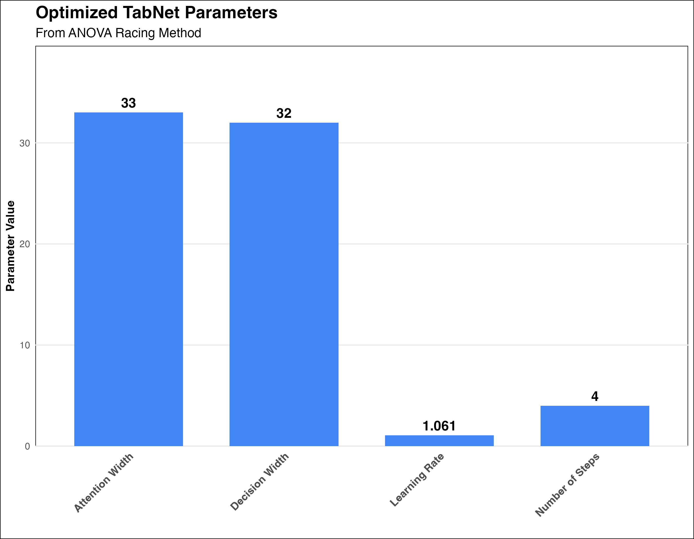
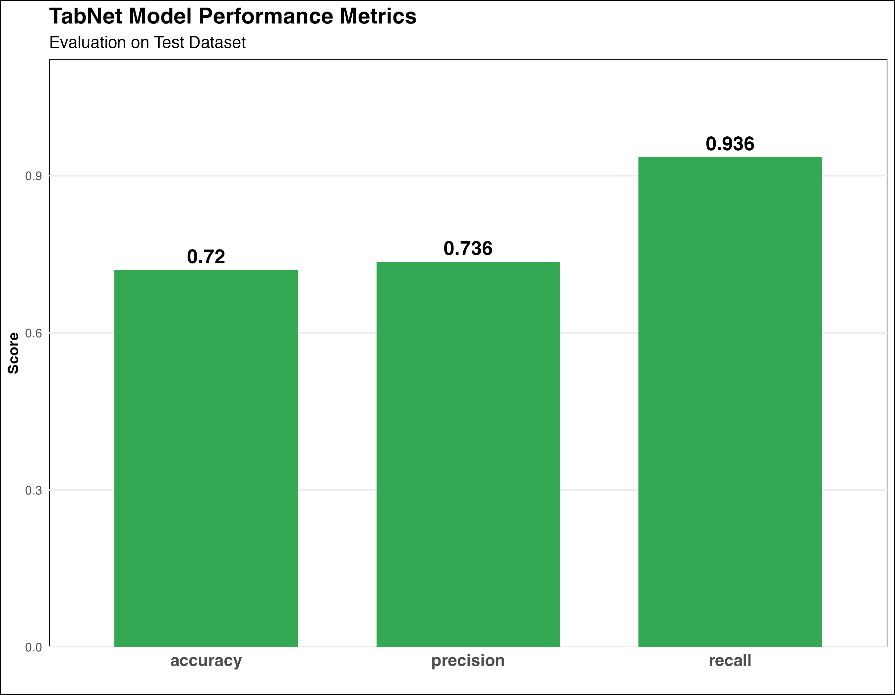
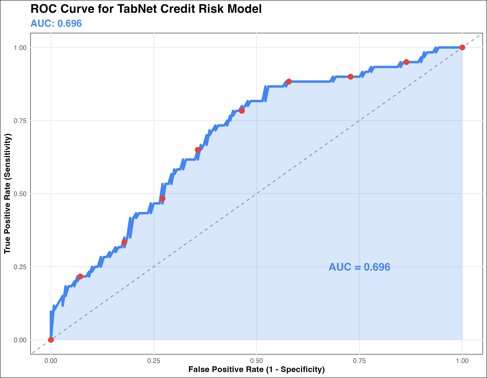
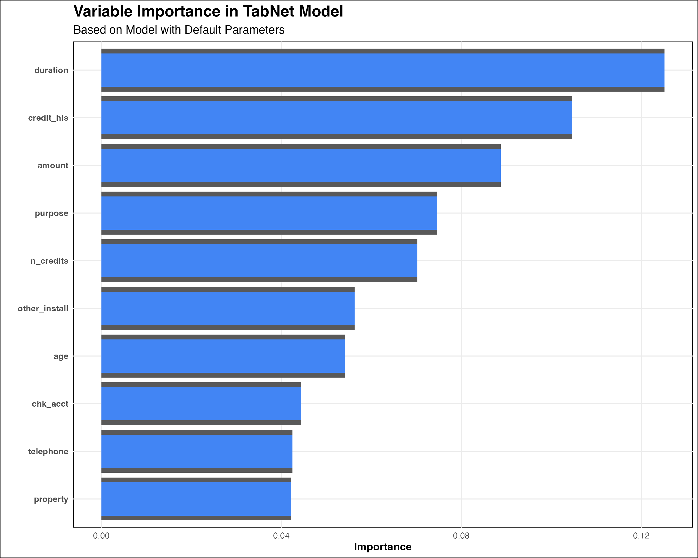

# TabNet Credit Risk Analysis

This project demonstrates the application of TabNet, a deep learning architecture, for credit risk modeling using the German Credit dataset within R's tidymodels framework.

## Overview

Credit risk assessment is a critical function in financial institutions. This project explores how TabNet, an attention-based neural network architecture, can be applied to predict credit risk with interpretable results. The implementation leverages the tidymodels ecosystem in R for a structured modeling workflow.

## Dataset

The analysis uses the German Credit dataset from the UCI Machine Learning Repository:
- 1000 credit applications with 20 features
- Binary classification target: good vs. bad credit risk
- Features include: checking account status, credit history, loan purpose, loan amount, savings status, employment duration, and more

Key features in the dataset include:
- `chk_acct`: Status of checking account
- `duration`: Duration of credit in months
- `credit_his`: Credit history
- `purpose`: Purpose of the loan
- `amount`: Credit amount
- `saving_acct`: Savings account/bonds status
- `present_emp`: Present employment since
- `age`: Age in years
- And more (full list available in the code documentation)

## Key Features

- Implementation of TabNet within the tidymodels framework
- Hyperparameter optimization using ANOVA-based racing methods
- Variable importance visualization to enhance model interpretability
- Cross-validation for robust performance evaluation

## Technical Stack

- **R**: Primary programming language
- **tidyverse**: For data manipulation and visualization
- **tidymodels**: For modeling pipeline and workflow
- **torch**: Deep learning backend
- **tabnet**: R implementation of TabNet architecture
- **finetune**: For hyperparameter optimization
- **vip**: For variable importance visualization

## Model Architecture

The TabNet model is configured with parameters based on the original TabNet paper (TabNet-S variant):

```r
# Training parameters
epochs = 200
batch_size = 512

# Network architecture parameters
decision_width = 39     # Width of decision prediction layer
attention_width = 38    # Width of attention embedding
num_steps = 4           # Number of decision steps

# Regularization parameters
penalty = 0.000001      # L2 regularization strength
virtual_batch_size = 512 # Size of virtual batches for batch normalization
momentum = 0.6          # Momentum for batch normalization

# Other TabNet-specific parameters
feature_reusage = 1.5   # Coefficient for feature reuse
learn_rate = 0.02       # Learning rate
```

## Hyperparameter Tuning Process

The project implements hyperparameter tuning using racing methods, specifically optimizing:

- Decision width (range: 20-40)
- Attention width (range: 20-40)
- Number of steps (range: 4-6)
- Learning rate (range: 10^-2.5 to 10^-1)

The racing approach efficiently eliminates underperforming hyperparameter combinations early in the evaluation process, saving computational resources.

### Optimized Parameters

After hyperparameter tuning, the following optimal parameters were identified:



*Figure 1: Optimal hyperparameters identified through ANOVA-based racing.*

## Model Performance

The model is evaluated using multiple metrics:
- Accuracy
- Precision
- Recall
- ROC AUC

Detailed performance metrics are generated through cross-validation and on a holdout test set to ensure robustness.

### Performance Visualization



*Figure 2: Performance metrics of the TabNet model on the test dataset.*

### ROC Curve



*Figure 3: ROC curve for the TabNet credit risk model.*

## Getting Started

### Prerequisites

This project requires R with the following packages:
```r
packages <- c("tidyverse", "torch", "tabnet", "tidymodels", "finetune", "vip")
```

### Installation

```r
# Install packages not yet installed
installed_packages <- packages %in% rownames(installed.packages())
if (any(installed_packages == FALSE)) {
  install.packages(packages[!installed_packages])
}
```

### Running the Analysis

Open the RMarkdown file `TidyTabNetCredit.Rmd` in RStudio and run all chunks to reproduce the analysis. The file includes:

1. Environment setup and package loading
2. Data loading and preprocessing 
3. Data splitting (80% training, 20% testing)
4. Model configuration and training
5. Hyperparameter tuning with cross-validation
6. Performance evaluation and visualization

## Implementation Approaches

The project demonstrates two different implementation approaches:

1. **Binary Numeric Approach**: Target encoded as 0/1 factors
   ```r
   # Recode the target variable: 1=good (coded as 1), 2=bad (coded as 0)
   Class = case_when(Class == 2 ~ 0, Class == 1 ~ 1)
   ```

2. **Categorical Approach**: Target encoded with meaningful labels
   ```r
   # Recode with meaningful labels
   german_credit$Class <- dplyr::recode_factor(german_credit$Class, 
                                            `1` = "good", `2` = "bad")
   ```

Both approaches leverage the tidymodels framework for consistent workflow management.

## Model Building Process

1. **Data Preprocessing**: 
   - Converting categorical variables to factors
   - Normalizing numeric features in the second implementation approach

2. **Initial Model**: 
   - Training TabNet with default parameters from the original paper
   - Saving the model for potential reuse

3. **Hyperparameter Tuning**: 
   - Using grid search with ANOVA-based racing method
   - Evaluating performance using 5-fold cross-validation

4. **Final Model**: 
   - Building optimized model with tuned parameters
   - Variable importance analysis through the VIP package

5. **Evaluation**: 
   - Assessing model performance on holdout test data
   - Calculating ROC AUC, accuracy, precision, and recall

## Benefits of TabNet

- **Feature Selection**: Built-in mechanisms to highlight important features
- **Interpretability**: Provides feature attribution at each decision step
- **Performance**: Competitive with other state-of-the-art tabular data models
- **Flexibility**: Works well with mixed data types (numerical and categorical)

### Variable Importance

One of TabNet's key advantages is its ability to provide feature importance, showing which variables most influenced the model's decisions:



*Figure 4: Variable importance plot showing the most influential features in the TabNet model.*

## Project Structure

- `TidyTabNetCredit.Rmd`: Main R Markdown document with code and documentation
- `tabnet_credit_risk_analysis.Rproj`: RStudio project file
- `saved_model.rds`: Saved TabNet model (generated when running the code)
- `images/`: Directory containing visualizations for the README

## License

This project is open source and available under the [MIT License](https://opensource.org/licenses/MIT).

## References

- Original TabNet paper: [TabNet: Attentive Interpretable Tabular Learning](https://arxiv.org/abs/1908.07442)
- German Credit Dataset: [UCI Machine Learning Repository](http://archive.ics.uci.edu/ml/machine-learning-databases/statlog/german/)
- TabNet R Package: [mlverse/tabnet](https://github.com/mlverse/tabnet)
- TabNet tidymodels interface: [Vignette](https://cran.r-project.org/web/packages/tabnet/vignettes/tidymodels-interface.html)